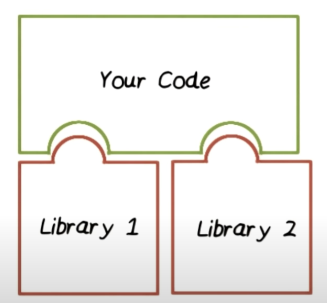

# Chapter 1. Basic Concept

## 1. Inversion of Control

在過往撰寫程式時，我們 code 會 include 某些 libraries，以不用重造輪子來使用這 function，而減少開發時間，

就如同下圖所示：

而這時，我們的 code 仍保有控制權。

Inversion of Control 的概念為，當我們使用某些框架時，其結構會如下圖所示：

Framework 會去處理資源的分配，並決定各個 element 呼叫的時機，有需要時才會呼叫我們的 code，並在 code 結束後，將控制權回到 framework 上。

也因此，當我們要在 framework 上增加一個新功能時，我們必須去 extend framework class 或在 framework 中插入自己寫的 class。

Inversion Control 其實就是 Hollywood Principle 的一種展現。

## 2. Hollywood Principle

Hollywood Principle 基於下面的精神：

> Don't Call Us, We'll Call You

在 OOP 中，就是高階物件不要主動地去依賴低階物件，而是低階物件要自己找到高階物件，並把自己丟入高階物件中。

Inversion Control 中 Framework 和我們自己的 code 的關係就滿足 Hollywood Principle。

## 3. Dependency Injection

下面為一段對於 dependency injection 的解釋：

> When you go and get things out of the refrigerator for yourself, you can cause problems. You might leave the door open, you might get something Mommy or Daddy doesn’t want you to have. You might even be looking for something we don’t even have or which has expired.

> What you should be doing is stating a need, “I need something to drink with lunch,” and then we will make sure you have something when you sit down to eat.

簡單來說，這邊提供的是一個介面，讓使用者可以直接根據需求使用介面，而不是提供實作，以避免不必要的麻煩。

## Reference

- [淺入淺出 Dependency Injection](https://medium.com/wenchin-rolls-around/%E6%B7%BA%E5%85%A5%E6%B7%BA%E5%87%BA-dependency-injection-ea672ba033ca)
- [Intro to Inversion of Control and Dependency Injection with Spring](https://www.baeldung.com/inversion-control-and-dependency-injection-in-spring)